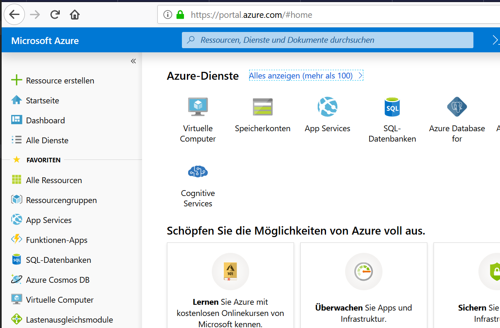
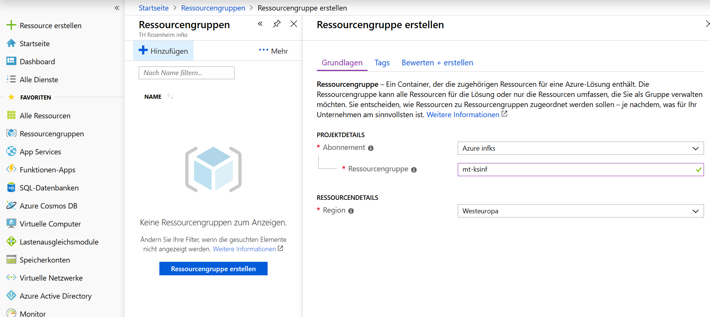
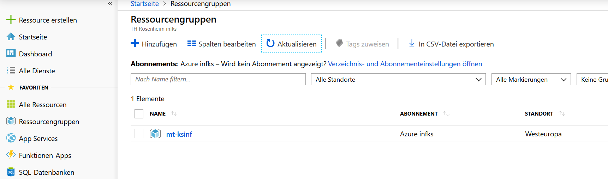

# Ziel der Übung

Zum Anfang ein paar Fingerübungen mit Azure und der IoT-Ready-To-Go Plattform von Azure ([IotCentral](https://docs.microsoft.com/de-de/azure/iot-central/)).

Über IoT Central:

Azure IoT Central ist eine vollständig verwaltete SaaS-Lösung (Software-as-a-Service), mit der Sie Ihre IoT-Ressourcen einfach vernetzen, überwachen und verwalten können. Azure IoT Central vereinfacht die anfängliche Einrichtung Ihrer IoT-Lösung und verringert den mit der Verwaltung und einem typischen IoT-Projekt verbundenen Aufwand sowie die Betriebskosten. Erfahren Sie anhand unserer Schnellstartanleitungen und Tutorials, wie Sie eine Azure IoT Central-Anwendung erstellen, anpassen, verwalten und verwenden.

---

## Azure Setup

So, mittlerweile sollten alle im Kurs eingeschrieben sein. Somit konnten alle User dem Azure AD hinzugefügt werden.

Wir nutzen in diesme Modul ein Azure Subscription und jeder sollte in seiner eigenen Ressourcegruppe arbeiten.

- Bitte folgen sie dem Link in der EMail und validieren bitte den Azure-Zugang.

- Idealerweise sollten sie auf dem [Azure Portal](https://portal.azure.com/) landen.

- Zum Test legen sie bitte eine neue _Ressourcegruppe_ mit dem Name **<ihr_kürzel>-IOTINF** an. Als _Region_ bitte **Westeuropa** wählen.

 

    Am unteren Rand nicht vergessen **Bewerte + erstellen** zu klicken. Danach sollte ihre Ressourcengruppe in der Liste der Ressourcengruppen erscheinen.

---

## IoT Central

Führen sie bitte die folgenden Lernprogramme auf IoT Central aus:

1. [Definieren eines neuen Gerätetyps](https://docs.microsoft.com/de-de/azure/iot-central/tutorial-define-device-type)
2. [Konfigurieren von Regeln und Aktionen für Ihr Gerät](https://docs.microsoft.com/de-de/azure/iot-central/tutorial-configure-rules)
3. [Anpassen der Azure IoT Central-Ansicht für Bediener](https://docs.microsoft.com/de-de/azure/iot-central/tutorial-customize-operator)
4. [Überwachen Ihrer Geräte](https://docs.microsoft.com/de-de/azure/iot-central/tutorial-monitor-devices)

**Fertig!!!**
